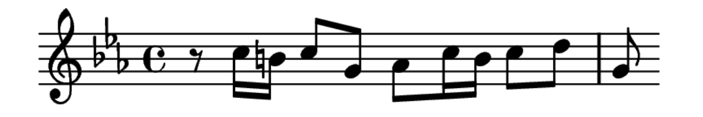
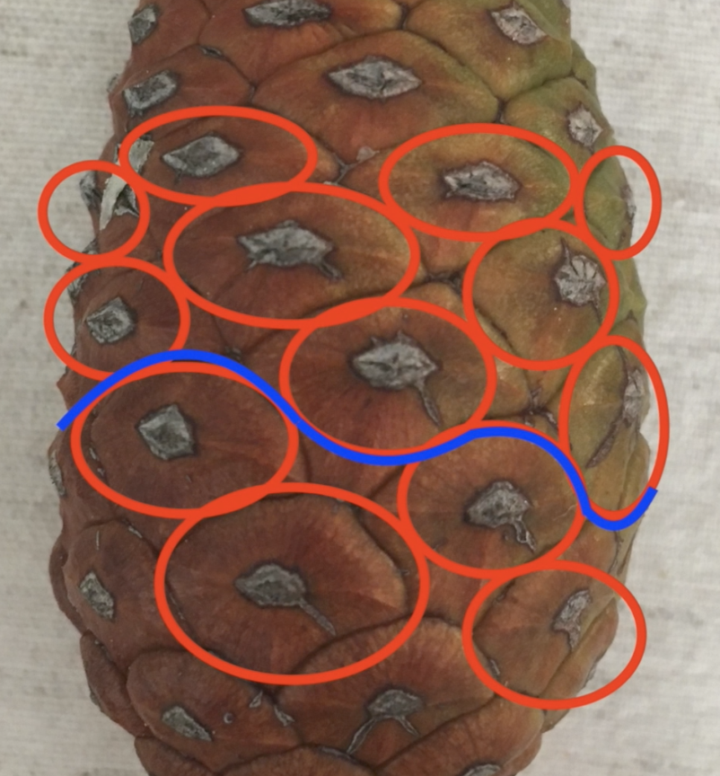
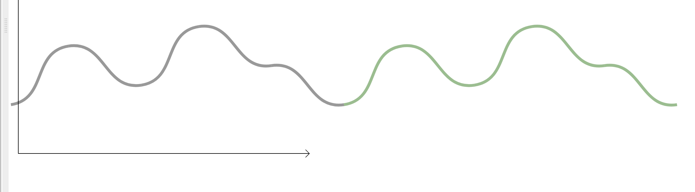
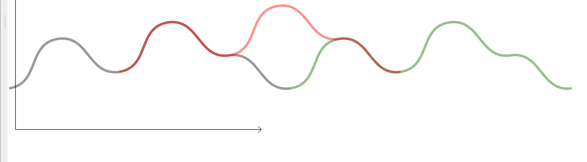
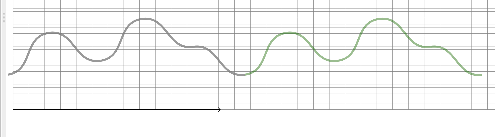
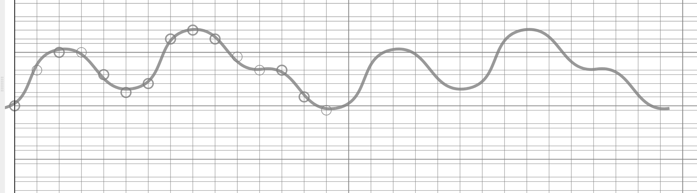
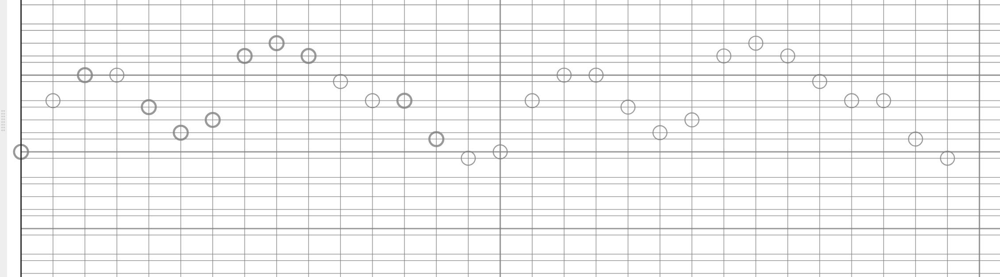
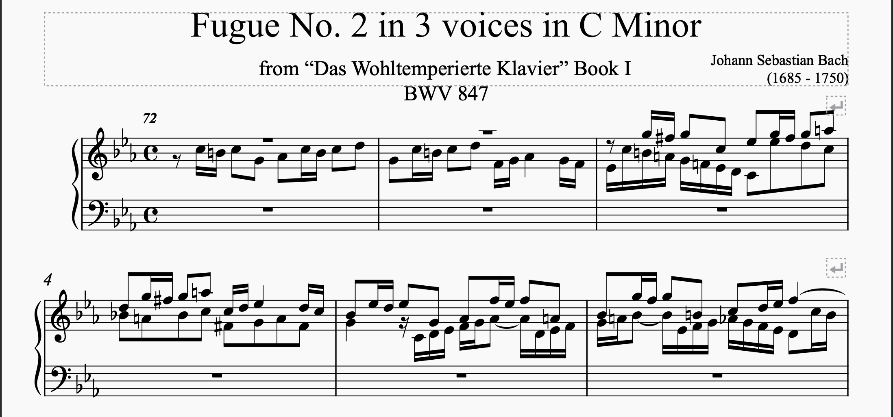
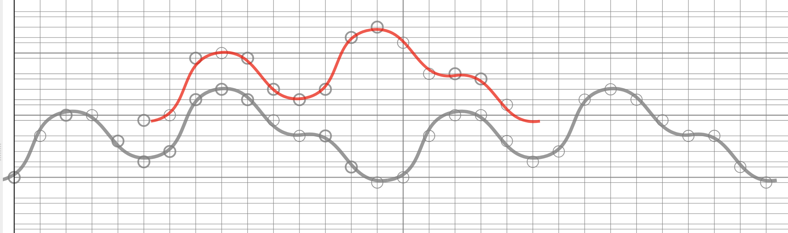

# Phylotaxy music


## Compiling & running the application

git, go version => 1.23 and npm version >= 18 are needed

```
git clone https://github.com/thomaspeugeot/phylotaxymusic.git
cd phylotaxymusic/ng-github.com-thomaspeugeot-phylotaxymusic
npm i
ng build
cd ../go/cmd/phylotaxymusic
go build
./phylotaxymusic -unmarshallFromCode=data/stage.go -marshallOnCommit=data/stage
```

launch your browser to http://localhost:8080/

should compile on mac, pc and linux.

## What is it ?

### Generating musical theme

You use phylotaxy music, a web application, for 
generating a music
theme. A music theme is a small suite 
of music notes, a melodic material.

 A wellknown theme is at the start of Bach's 2nd 
 fugue in C minor.

 

By turning 
knobs in the webapp, you generates 
a musical theme of your own. 
You can hear it in the app 
(by way of a simple 
webaudio synthesizer).

If you want to compose something 
more elaborate, you can export
your theme
to a musicxlm file. 
musicxml is a standard 
format recognized by
lot of score editing 
software (including musescore).

### Phylotaxy

Phylotaxy means "shape of leaves". 
It is the 
science developped by botanist, 
mathematicians and physicists 
to understand why plants
have the shape they have.

Those guys have fun jobs.

In the office of Stephane D.,
a "spiral plants" specialist I 
visited, the shelves are full of 
beautiful 
dried specimen that people 
sent to him
from all over the world. 
Each plant has spectacular
spiral arragenements of leaves
that run upward the trunks.

A common spiral plant is the pinecone.

Stephane taught me that when 
the trunk grows, 
the cells
at the stem divide themselves. New cells
 end up building
the trunk but regularly, 
one of them differentiates and
becomes a leave. 
Because this happens on a regular tempo, 
the leaves arrange themselves along 
the trunk
in spiral patterns. 
Stephane pointed out that if you draw
a curve around the trunk to isolate 
one leave cell from
newer leave cells, you end up drawing 
the "front curve"
of the plant growth.



Stephane then compared a new leave cell 
to the last one.
Because leave cells appear regularly, 
a new cell is 
always located with the same distance
 above and the
same angle sideway, 
a rotation near 168 degrees, 
related to the golden ratio. 
Therefore, the "front curve" has 
this interesting geometric feature : 
but on the new leave cell,
it overlaps itself
after an upward translation 
and a rotation. Let's demonstrate this.

Use a grey pen and draw the unfolded the front curve on a piece 
of paper.


Use a green pen and draw the same curve at the right of the first.



Draw it again
on a tracing paper with a red pen and put the tracing 
paper above and
shift it a bit to the right and 
a bit to the top.



We did it ! The overlapping 
is perfect 
except for one space that have
the shape of an eye (
the place for the leave).

### Generating a theme form the front curve 

Now take take the first drawing and add a canevas
of vertical measure lines and horizontal pitch lines.

For the pitch lines, the spacing between pitch line
follows the scale of your choice. If you
choose a C minor scale, the tone differences between
notes are 1, 1/2, 1, 1, 1/2, 1 and 3/2.



Now, along the front curve, when it intersect the 
measure lines, 
draw some notes of your choosing.



You now have created a musical theme.



### Polyphonic music

It happens that a musical theme is 
suitable for polyphonic harmony,
a canon for instance, if it has 
some properties. 
A polyphonic theme is played twice.
The second time the theme is played,
it is played with a 
shift in time and a shift in pitch 
(a fifth for instance). 
The whole is harmonious.



### From phylotaxy to polyphony

TBC



The idea of phylotaxy music is to 
generate a front curve from botanical 
parameters and to generate 
the notes of a musical theme from
this curve.

## User Interface

## Output interface

MusicXML


