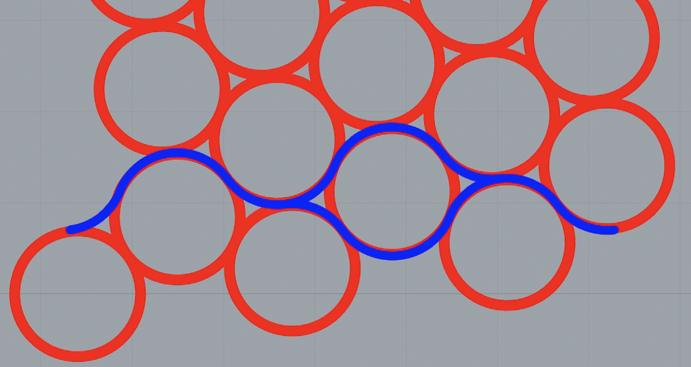

# Phylotaxy music

## what is it ?

You use phylotaxy music, a web application, for 
generating a music
theme. A music theme is a small suite 
of music notes. Think of it as something you
 can whistle.

By turning 
knobs in the application, you generates 
a musical theme . 
You can hear it in the app 
(by way of a simple 
webaudio synthesizer). 
If you want to compose something 
more elaborate, you can export
your theme
to a musicxlm file. 
musicxml is a standard 
format recognized by
lot of score editing 
software (including musescore).

Phylotaxy means "shape of leaves". 
It is the 
science developped by botanist, 
mathematicians and physicists 
to understand why plants
have the shape they have.

Those guys have fun jobs. 
In the office of Stephane D.,
a "spiral plants" specialist I 
visited, the shelves are full of 
beautiful 
dried specimen that people 
sent to him
from all over the world. 
Each plant has spectacular
spiral arragenements of leaves
that run upward the trunks.

Stephane taught me that when 
the trunk grows, 
the cells
at the stem divide themselves. New cells
 end up building
the trunk but regularly, 
one of them differentiates and
becomes a leave. 
Because this happens on a regular tempo, 
the leaves arrange themselves along 
the trunk
in spiral patterns. 
Stephane pointed out that if you draw
a line around the trunk to isolate 
one leave cell from
newer leave cells, you end up drawing 
the "front line"
of the plant growth.

Stephane then compared a new leave cell 
to the last one.
Because leave cells appear regularly, 
a new cell is 
always located with the same distance
 above and the
same angle sideway, 
a rotation near 168 degrees, 
related to the golden ratio. 
Therefore, the "front line" has 
this interesting geometric feature : 
but on the new leave cell,
it overlaps itself
after an upward translation 
and a rotation.

Now, unfolds the front line on a piece 
of paper. 
If you draw it again
on a tracing paper. Put the tracing 
paper above and
shift it a bit to the right and 
a bit to the top. The overlapping 
is perfect 
except for one space that have
the shape of an eye (
the place for the leave).

It happens that a musical theme is 
suitable for polyphonic harmony,
a canon for instance, if it has 
some properties. 
A polyphonic theme is played twice.
The second time the theme is played,
it is played with a 
shift in time and a shift in pitch 
(a fifth for instance). 
The whole is harmonious.

The idea of phylotaxy music is to 
generate a front line from botanical 
parameters and to generate 
the notes of a musical theme from
this line.

## User Interface

## Output interface

MusicXML

